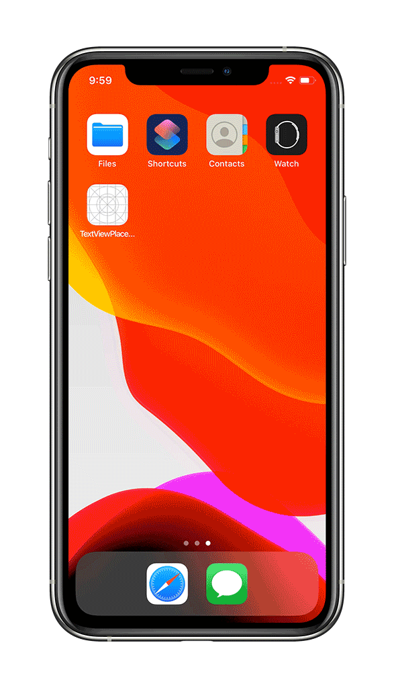

# TextViewPlaceholderSample
Example of a `UITextView` with a placeholder in Swift.

<p align="center">
  
</p>

## QuickStart
1. Clone this repository.
```
$ git clone https://github.com/harrisonrw/TextViewPlaceholderSample.git
```

2. Open the project in Xcode.
```
$ open TextViewPlaceholderSample.xcodeproj
```

3. Build and Run in the **iOS Simulator**.

## Requirements
- Xcode 11.5
- iOS 13.5+
- Swift 5
